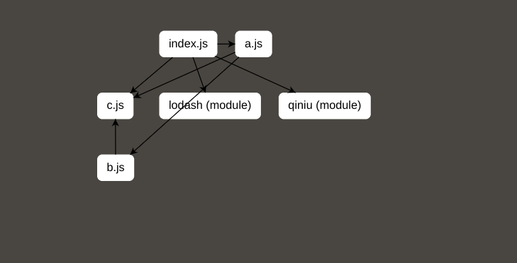

## 介绍

webpack 引用模块依赖分析，从入口到每个模块以图的形式展现出来。



## 使用

```js
import WebpackTreeDenpendensPlugin from 'webpack-tree-denpendens-plugin';

export default {
    // ...

    plugins: [
        // ...
        new WebpackTreeDenpendensPlugin(),
    ],
};
```
